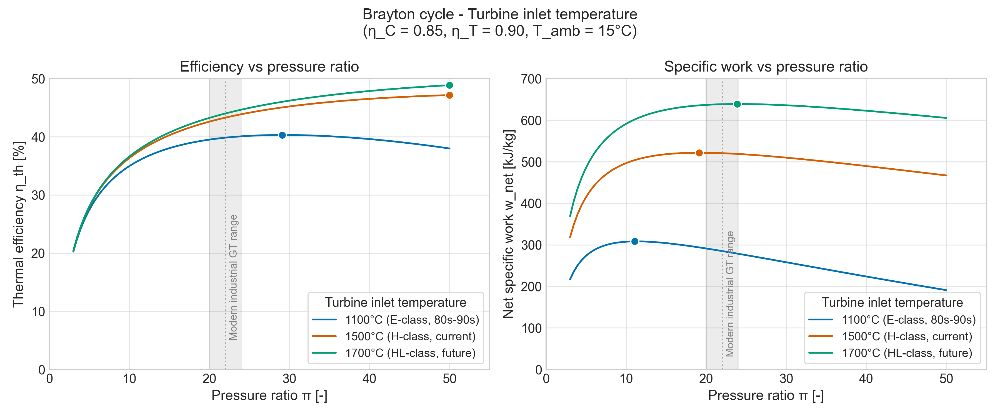

# Brayton Cycle Analyzer

A Python tool for thermodynamic analysis of simple-cycle stationary
gas turbines, using real-fluid properties from CoolProp.

## What it does

Computes the four state points, specific work, heat input, and thermal
efficiency of a Brayton cycle with non-ideal compressor and turbine. Sweeps
over pressure ratio (π) and turbine inlet temperature (TIT) to map the
efficiency–specific-work design space across three eras of gas turbine
technology.

## Theory

The cycle consists of four processes:

| Process | Description                         | Assumption          |
|---------|-------------------------------------|---------------------|
| 1 → 2   | Compression                         | Non-isentropic, η_C |
| 2 → 3   | Heat addition (combustion)          | Constant pressure   |
| 3 → 4   | Expansion                           | Non-isentropic, η_T |
| 4 → 1   | Heat rejection (open-cycle closure) | Constant pressure   |

Non-ideal turbomachinery is modeled with isentropic efficiencies:

- `h2 = h1 + (h2s − h1) / η_C`   (compressor takes more work than ideal)
- `h4 = h3 − η_T · (h3 − h4s)`   (turbine delivers less work than ideal)

Performance:

- Net specific work: `w_net = (h3 − h4) − (h2 − h1)`
- Thermal efficiency: `η_th = w_net / (h3 − h2)`

Air properties are evaluated with CoolProp, capturing the variation of
specific heat with temperature — relevant at TIT > 1500 K, where the
constant-cp approximation overpredicts efficiency by several percentage
points.

## Results



Three turbine inlet temperatures are swept across the pressure-ratio range
covering all stationary and aeroderivative gas turbines:

- **1100 °C** — representative of early heavy-duty industrial GTs (E-class, 1980s–90s)
- **1500 °C** — current modern heavy-duty machines (H-class)
- **1700 °C** — projected next-generation and R&D targets (HL-class)

The grey band marks the pressure-ratio range of typical modern heavy-duty
gas turbines (π ≈ 20–24). The plot illustrates two central design tradeoffs:
efficiency rises monotonically with TIT (driving the industry's continuous
push toward higher firing temperatures through advanced cooling and
materials), and the pressure ratio that maximizes thermal efficiency is
higher than the one that maximizes specific work.

### Reference case

Inputs: π = 18, TIT = 1700 K (1427 °C), η_C = 0.85, η_T = 0.90, ambient
15 °C / 1.013 bar.

| Quantity              | Value         |
|-----------------------|---------------|
| Compressor outlet T_2 | 710.0 K       |
| Exhaust T_4           | 928.4 K       |
| Net specific work     | 480.3 kJ/kg   |
| Heat input            | 1157.3 kJ/kg  |
| Thermal efficiency    | 41.5 %        |

The computed efficiency is consistent with simple-cycle ratings reported
for modern industrial gas turbines at comparable operating points
(typically 38–43 %).

## How to run

```bash
git clone https://github.com/gbrandenbusch/brayton-analyzer.git
cd brayton-analyzer
python -m venv .venv
source .venv/bin/activate     # Windows: .venv\Scripts\activate
pip install -r requirements.txt

python brayton.py             # reference case → terminal
python sweep.py               # parametric plots → results/
```

## File structure

```
brayton.py         # Defines compute_cycle(pi, T3, eta_C, eta_T, ...)
sweep.py           # Parametric sweep over π and TIT, saves headline plot
requirements.txt   # Python dependencies (CoolProp, numpy, matplotlib)
results/           # Generated figures
```

## Limitations

- Air-standard cycle: no fuel mass addition, constant working fluid composition
- No pressure losses in combustor, ducts, or inlet/exhaust
- No turbine blade cooling air bleed (cooling reduces effective TIT and η)
- No mechanical, bearing, or generator losses
- Constant component efficiencies (real η_C, η_T vary with operating point)
- No part-load behavior (only design-point performance)

## Next steps

- Recuperated cycle (exhaust → combustor inlet heat exchanger)
- Intercooled–reheated configuration
- Combined-cycle (Brayton topping + Rankine bottoming)
- Fuel mass addition with combustion-product mixture (replace `'Air'` with a methane–air mixture)
- T-s diagram for the reference case
